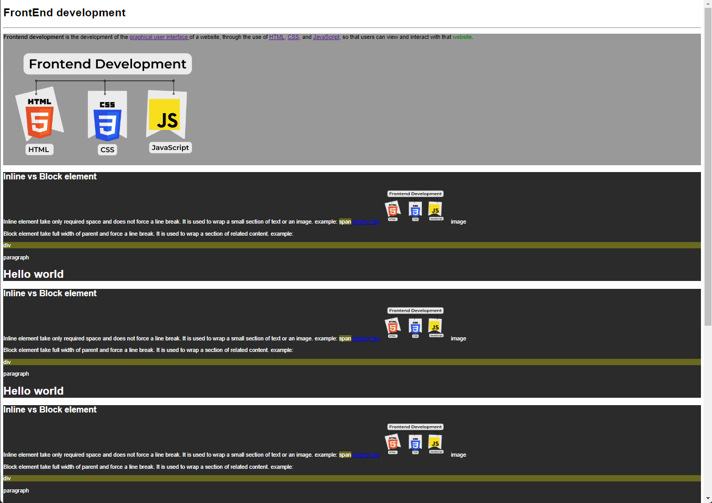

# Basic building blocks of HTML

## Image

## Basic building blocks of HTML

    <h2>div</h2>
    
div is a block level element which is used to group other HTML elements. It is used to add structure to the page, 
        to group related content together, and to apply styles to a group of elements. It is also used to create a 
        container for other elements, such as a header, footer, or sidebar.

    <h2>anchor tag</h2>
    
anchor tag is an inline element which is used to link a page to another page or to a certain section of the same page. 
        It is used to define a hyperlink. It contains an href attribute which specifies the URL of the page the link goes to 
        and some content between the opening and closing tags of the anchor element.

    <h2>img</h2>
    
img tag is an inline element which is used to add an image on the web page. It contains a src attribute which specifies 
        the URL of the image and some content between the opening and closing tags of the img element.

    <h2>span</h2>
    
span is an inline element which is used to wrap a small section of text. It is used to group inline-elements in a document. 
        It is used to add some style to the text, such as color, font-size, font-style, etc. It is used to select the text and copy it to the clipboard.

